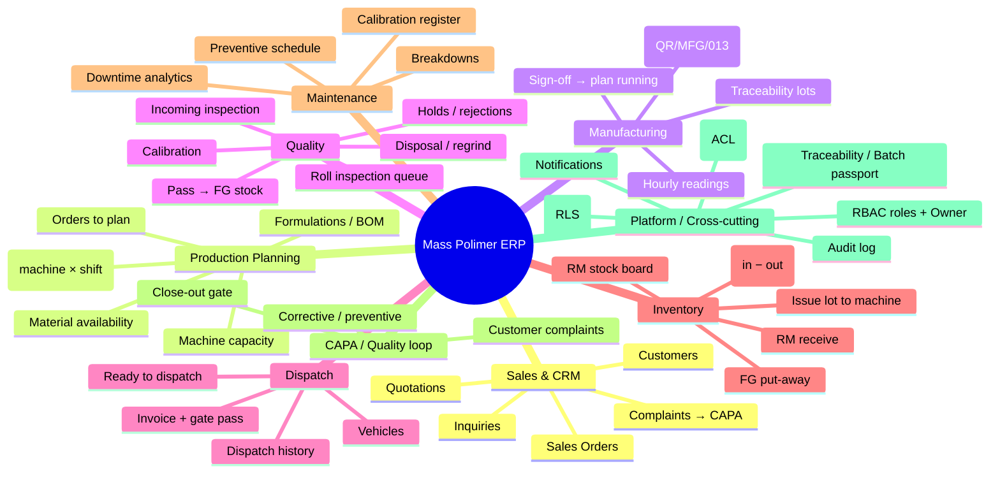
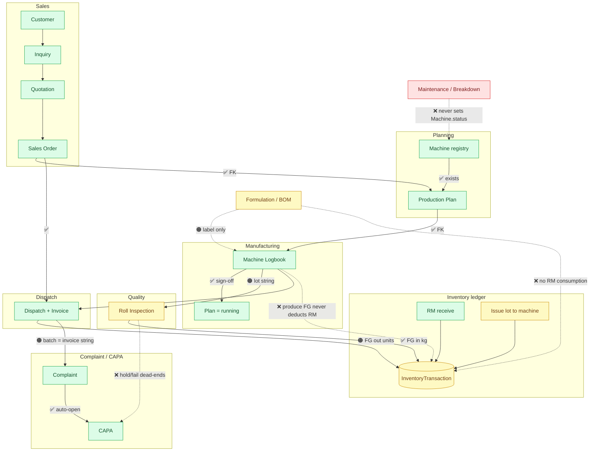

# Mass Polimer ERP — Business Mind Map & Flow Gap Analysis

> A deep dive into every business flow of the Mass Polimer ERP, the connections between them,
> and — most importantly — **the flows and connections that are still missing or broken.**
> Generated from a full-codebase audit (frontend screens, backend modules, Prisma data model,
> and cross-module wiring). Evidence is cited as `file:line`.

**Legend used throughout:** ✅ WIRED (real FK / status transition) · 🟠 PARTIAL (works via plain-string ref, manual re-entry, or display-only) · ❌ MISSING / BROKEN (data never reaches the next step).

---

## 1. Business Mind Map

---

## 2. The Value Chain — Flow & Connection Status

**Reading it:** the green spine (**Sales → Planning → Logbook → Quality → Dispatch → Complaint → CAPA**) is genuinely wired with foreign keys and guarded status transitions. The dotted red/amber lateral arrows are the **missing business connections** — formulation-driven material consumption, maintenance→machine→planning, and the QA-rejection→CAPA loop.

---

## 3. Architecture Reality — "Two Apps in One Repo"

The codebase contains a **real API backbone** and a **legacy click-dummy** running side by side. The same business concept often has **two divergent sources of truth**.

| Layer | What it is | Persisted? | Tenant-scoped? |
|---|---|---|---|
| **Real API** (`src/lib/queries/*` → `server/src/modules/*` → Postgres) | 9 modules behind `authenticate`+`resolveTenant`+RLS | ✅ Postgres | ✅ Yes |
| **Legacy blob** (`/api/data`, `server/src/legacy/dataJson.ts`, seeded from `src/mockData.ts`) | A single shared JSON blob, mounted **before** auth | ⚠️ shared blob | ❌ No |
| **In-memory stores** (`src/lib/*Store.ts`, `useSyncExternalStore`; App lifted `useState`) | Client-only, reset on reload | ❌ No | ❌ No |
| **Static** | Hardcoded arrays in components | ❌ No | ❌ No |

**Duplicated / unsynced sources of truth (high-impact):**
- **Customers / Inquiries / Orders / Complaints / CAPA** — the *Sales role* screens use the API; the core `Customers` / `SalesModule` / `CapaComplaints` and all MD/Planner dashboards read the **legacy blob copy**. Creating a customer as Sales does **not** appear in the core grid, and vice-versa.
- **Production plans** — `OrdersToPlan`/`PlanBoardScreen` (API) vs `PlannerHome`/`MachineCapacity`/`Planning.tsx` (legacy blob).
- **Logbooks** — operator capture is API; templates + the aggregate `machineLogbooks` list used by `QualityPacking`/`Reports`/MD stay in the legacy blob → those read stale data.
- **Formulation** (real API + Postgres) vs **Recipe/BOMItem** (orphan models) vs **`ManufacturingStandards.tsx`** (self-contained mock).

---

## 4. Deep Dive — Every Flow

### 4.1 Sales (✅ solid)
`customer → inquiry → quotation → order`, all real FKs and status guards (`sales/service.ts`).
- Statuses the backend actually sets: Inquiry `submitted → quotation → ordered`; Order `pending`.
- Server-issued numbers `INQ-/SO-`; one-order-per-inquiry guard; GST-unique-per-tenant.
- **Phantom status:** Inquiry `approved` is accepted as quotable (`sales/service.ts:86`) but **no code ever sets it**.

### 4.2 Planning (✅ spine wired, ❌ no capacity/availability)
- `order (pending) → ProductionPlan (scheduled)`, order → `planned`; machine is a real FK; double-booking guarded (`planning/service.ts:44-70`).
- ❌ **No machine-availability check** — a plan can be scheduled on a down machine (`:50-59` checks existence + clash only, never `Machine.status`).
- 🟠 `MachineCapacity` and `MaterialAvailability` screens are **mock / in-memory** (`plannerStore`), ignoring the real `/inventory/stock`.

### 4.3 Manufacturing / Logbook (✅ wired, 🟠 formula is a label)
- `plan → logbook` (1:1 FK), template resolved by `machine.logbookFormat`; submit requires `operatorSignature` → plan `running` (`logbook/service.ts`).
- 🟠 `formulaNo` picked from active formulations is a **display string only** (`schema.prisma:270`) — no component list read.
- ❌ **Producing a logbook deducts no raw material.**
- **Dead-end:** plan `running` is never advanced to `completed`.

### 4.4 Quality (✅ pass path, ❌ reject path)
- Roll queue derived from submitted logbooks' `traceabilityRows` (🟠 by lot **string**, not entity); **pass → FG stock** InventoryTransaction (`quality/service.ts:62-71`).
- ❌ **`hold` / `fail` dead-end** — writes a `QualityInspection` row and stops. `CAPARecord.rejectionId` exists but is **never set anywhere** (0 references). No rejection→CAPA, no regrind ledger.
- 🟠 `QAHome`, `IncomingInspection`, `DisposalRegrind`, `CalibrationDue` are in-memory/static.

### 4.5 Dispatch (✅ wired, 🟠 FG reconciliation broken)
- Ready = order whose plan has a submitted logbook, not yet dispatched → `DispatchRecord` (`INV-`), order → `dispatched`, FG **out** (`dispatch/service.ts`).
- 🟠 **FG stock never reconciles:** QA books FG **in** as *kg-per-roll*, dispatch books **out** as *units-per-order*; `computeStock` groups by `type::itemName::unit`, so the two live in different buckets and never net.
- 🟠 `DispatchHome`, `GatePass`, `VehiclesToday` are in-memory/static. `DispatchRecord.status` dead-ends at `shipped` (no delivery confirmation).

### 4.6 Inventory (✅ ledger, ❌ not driven by production)
- Stock derived from the append-only `InventoryTransaction` ledger; RM receive/issue with machine-exists + sufficient-stock checks (`inventory/service.ts`).
- ❌ **Issue is manual** — one typed item to a machine, `reference` a free string; **no plan/formulation link, no BOM-driven auto-deduction.**
- 🟠 `FGPutaway`, `RegrindLots`, `StoreHome` are in-memory.

### 4.7 CAPA / Complaint loop (✅ solid)
- Complaint only against a **dispatched** batch → auto-opens a CAPA with SLA due date; close-out requires root/corrective/preventive; complaint resolves only after CAPA closed (`capa/service.ts`).
- 🟠 Links are plain strings: `Complaint.capaId`, `Complaint.batchNumber = invoiceNumber`, `CAPARecord.complaintId` — joined in code, not by relation.

### 4.8 Maintenance (❌ disconnected from the plant)
- `MaintenanceTask` create/complete works with a real machine FK (`maintenance/service.ts`).
- ❌ **Raising a breakdown never downs the machine** — the operator "Raise breakdown" writes to a **client-only in-memory store** (`operatorStore.ts`), never reaching Postgres or `Machine.status`. Planning therefore can't see it.
- ❌ Preventive schedule is a **static string list**, unconnected to any runtime/usage feed. `Breakdowns`, `Downtime`, `MachineHistory`, `CalibrationRegister` are all in-memory.

### 4.9 Formulation / BOM (✅ CRUD, ❌ not consumed)
- Real tenant-scoped `Formulation` (code + rev + JSON components), add/edit, revision supersede, lock guard (`formulation/service.ts`). Picked into the logbook's Formula No.
- ❌ **Components are never expanded into RM consumption.** The legacy `Recipe`/`BOMItem` tables are orphaned; `ManufacturingStandards.tsx` runs on the mock blob.

### 4.10 Platform (✅ tenancy/RBAC/audit, ❌ dynamic ACL not persisted)
- ✅ **Multi-tenancy:** Postgres RLS (`FORCE`) on every tenant table + non-superuser `app_user` + `AsyncLocalStorage` tenant context + guarded Prisma (fail-closed). 
- ✅ **RBAC:** server-authoritative `requirePermission` on every route; `ADMIN_ROLES = {Owner, Administrator, Admin, Management}`.
- ✅ **Audit:** `audit()` appends an `AuditEvent` on every lifecycle transition (draft edits intentionally not audited; `AuditEvent` has no read endpoint).
- ❌ **Dynamic ACL is client-only:** `PermissionRule` / `EmployeeGrant` / `Delegation` tables exist but have **no router and are never read** — the People directory, role grants, and delegation approvals live in `localStorage`/in-memory and vanish on reload. The effective policy is hardcoded in `permissions.ts`.
- ❌ **Notifications/nudges** are in-memory; `pushNudge` is a no-op.

---

## 5. Connection Matrix

| From → To | Status | Evidence | What's missing |
|---|---|---|---|
| Customer → Inquiry → Quote → Order | ✅ | `sales/service.ts`; `schema.prisma` FKs | — |
| Order → Production Plan | ✅ | `planning/service.ts:44-70` | — |
| Plan → Machine (existence) | ✅ | `schema.prisma:210` FK | — |
| Plan → Machine (**availability**) | ❌ | `planning/service.ts:50-59` | No down-machine guard |
| Plan → Logbook → `running` | ✅ | `logbook/service.ts:80-127` | Plan `running` never `completed` |
| Logbook → QA roll queue | 🟠 | `quality/service.ts:19-35` | Rolls not entities; lot **string** dedup |
| QA pass → FG stock | ✅ | `quality/service.ts:62-71` | Booked in kg (see next) |
| Dispatch → FG stock out | 🟠 | `dispatch/service.ts:65-71` | Units-per-order vs kg-per-roll → **never nets** |
| Order/Logbook → Dispatch | ✅ | `dispatch/service.ts:17-20,49-63` | Invoice references no specific lots |
| Dispatch → Complaint → CAPA | ✅ | `capa/service.ts:37-63` | Batch tie is a **string** (no `dispatchId` FK) |
| **Formulation → Logbook** | 🟠 | `logbook/service.ts:20-26`; `schema.prisma:270` | Label only; components never read |
| **Formulation → RM consumption** | ❌ | none | % never used; production consumes nothing |
| **Inventory issue → Plan/Formulation** | ❌ | `inventory/service.ts:57-77` | Manual; no plan/BOM link |
| **Produce FG → deduct RM** | ❌ | `logbook/service.ts:114-127` | No RM movement on production |
| **Maintenance → Machine.status** | ❌ | `maintenance/service.ts:26-37` (0 status writes) | Breakdown never downs machine |
| **QA hold/fail → CAPA** | ❌ | `quality/service.ts:62`; `rejectionId` unused | No rejection→CAPA loop |
| RBAC / Owner | ✅ | `middleware/authz.ts`; `permissions.ts` | Client `can()` cosmetic (by design) |
| PermissionRule/EmployeeGrant/Delegation → API | ❌ | no router (`app.ts`); `accessStore.ts` localStorage | ACL edits never persist server-side |
| Notifications / nudges | ❌ | `Notify.tsx` (`pushNudge` no-op) | Not persisted/backed |
| Batch Passport / genealogy | ❌ (mock) | `BatchPassport.tsx:10-27`; `mockData.ts:509-548` | 2 hardcoded lineages; string match |
| Dashboard / Reports / MD | ❌ (mock) | `Dashboard.tsx:112-134`; `Reports.tsx:64-84`; `simulation.ts` | Fabricated trends; `Math.random()` machines |

---

## 6. Missing Flows & Connections — Prioritized

1. **RM consumption is never booked against production.** The plant produces & dispatches FG while raw-material stock never moves → inventory is fiction for costing/reorder. *Fix:* on `logbook.submit`, expand the picked formulation's components × produced kg into RM-`out` `InventoryTransaction` rows (ref = `productionPlanId`); give `Formulation.components` real RM `itemName`/`lotId`.
2. **FG stock never reconciles (unit mismatch).** *Fix:* standardize FG UOM + item key (per-lot, kg) across `quality/service.ts:67` and `dispatch/service.ts:68`; dispatch retires the specific inspected lots.
3. **Maintenance breakdown doesn't down the machine; planning ignores machine status.** *Fix:* a real breakdown endpoint sets `Machine.status='down'`; `createPlan` rejects non-`running` machines; clear on close.
4. **QA rejections/holds dead-end — no CAPA loop.** *Fix:* in `createInspection`, when `decision !== 'pass'`, auto-open a `CAPARecord` with `rejectionId = inspection.id` (mirror the complaint path); optionally book a regrind/scrap movement.
5. **No real lot genealogy / batch passport.** *Fix:* promote rolls/lots to first-class rows (or index the logbook JSON); add FKs `inspection.logbookId`, `dispatch↔lot`, `complaint.dispatchId`; back `BatchPassport` with a `/trace/:lot` endpoint.
6. **Dashboards / Reports / MD are mock.** *Fix:* add REST aggregate endpoints; point those screens at `lib/queries` instead of App mock state.
7. **ACL / delegation / notifications are client-only.** *Fix:* mount an acl/delegation router writing `PermissionRule`/`EmployeeGrant`/`Delegation`; have `authz` read tenant overrides from `PermissionRule`.
8. **Order lifecycle has no production phase + dead-end statuses.** *Fix:* add `in_production`/`produced` order status on logbook submit, a plan `completed` state, a dispatch `delivered` transition; remove the phantom inquiry `approved`.
9. **Legacy click-dummy overlaps the real API (architectural).** *Fix:* retire `*Module.tsx` / `/api/data` blob / mock stores as each domain's `*Screens.tsx` API port lands; delete or wire the orphan models.

---

## 7. Data-Model Gaps

### Orphan models (defined, tenant-scoped, RLS'd — but **zero API usage**)
| Model | Why it's orphaned |
|---|---|
| `Recipe`, `BOMItem` | Superseded by `Formulation`; only the legacy `/api/data` blob touches them |
| `PackingRecord` | No packing router; QA queue reads logbook JSON instead |
| `Supplier` | No module (MD "quality memory" uses mock `initialSuppliers`) |
| `PermissionRule`, `EmployeeGrant`, `Delegation` | Dynamic authz never read from DB; policy hardcoded in `permissions.ts` |
| `AuditEvent` | Write-only (no read endpoint) — intentional, but no audit viewer |

### Soft links (plain-string refs that should be FK relations)
`Complaint.capaId` → `CAPARecord.id` · `Complaint.batchNumber` → `DispatchRecord.invoiceNumber` · `CAPARecord.complaintId` → `Complaint.id` · `CAPARecord.rejectionId` → *(no rejection entity modeled)* · `Formulation.capaId` → `CAPARecord.id` · `MachineLogbook.formulaNo` → `Formulation.code` · `MachineLogbook.machineId` → `Machine.code` *(a code, not the FK — contrast `ProductionPlan.machineId`)* · `Machine.currentFormula/currentLot/currentProduct` → denormalized strings · `QualityInspection.lotNumber/rollNumber` → `MachineLogbook.traceabilityRows[].lotNumber` (string-matched) · `InventoryTransaction.lotNumber/itemCode/reference` → free-text cross-refs.

---

## 8. Frontend Migration Status (screens on the real API)

**✅ On the tenant-scoped API:** Sales (Inquiries, Quotations, Orders, Customers, Complaints+CAPA) · Planning (OrdersToPlan, PlanBoard, Formulations) · Logbook (operator capture) · Quality (RollQueue, Holds) · Store (Receive, IssueLot, RMStock) · Dispatch (Ready, History) · Maintenance (PreventiveSchedule).

**❌ Still in-memory only (lost on reload, no tenant scope):** all Operator screens (hourly readings, breakdowns) · most Maintenance (Breakdowns, Downtime, MachineHistory, CalibrationRegister) · Quality (QAHome, Incoming, DisposalRegrind) · Store (StoreHome, FGPutaway, RegrindLots) · Planner (MaterialAvailability) · Dispatch (Home, GatePass) · **Admin (People & Roles directory, Access Control)** — note the API resolves identity from a directory that is itself client-only.

**⚠️ On the legacy `/api/data` blob:** all core `*Module.tsx` (Dashboard, Customers, SalesModule, Planning, QualityPacking, InventoryModule, DispatchModule, CapaComplaints, Reports, MigrationHub) · logbook template builder · MD KPI numbers · BatchPassport.

**Dead links:** none. **Orphan renders:** none (all core ids reachable via the `Owner`/fallback menu).

---

## 9. What's Genuinely Solid

The **Sales → Planning → Logbook → Quality → Dispatch → Complaint → CAPA** spine (real FKs + guarded transitions), the **audit log**, **multi-tenant RLS isolation**, and **server-enforced RBAC with the Owner superuser** are production-grade. The gaps above are lateral connections and the legacy-vs-API convergence — not the core transactional backbone.
