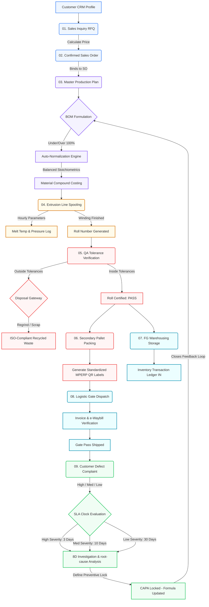

# Mass Polymer ERP Enterprise Suite: End-to-End Operational Flow Guide

This document maps out the comprehensive, step-by-step operational workflow of the Mass Polymer ERP. It outlines how commercial, operational, quality, logistical, and feedback nodes connect in a unified full-stack state machine.

---

## 1. Unified Visual Flow Chart

This ASCII flow chart illustrates the complete life cycle of material, financial valuation, and transactional data as it flows through the plant:

```
========================================================================================
                         STAGE 1: SALES & COMMERCIAL INGESTION
========================================================================================

    [ CRM Customer Database ]
                |
                v
     [ 01. Inbound Inquiry (RFQ) ] -----> Draft Quote Drafted
                |
                v
     [ 02. Confirmed Sales Order ] -----> Set Priority Flag (Low/Medium/High)
                |                         & Payment/GST Coordinates
                v
========================================================================================
                         STAGE 2: CAPACITY PLANNING & FORMULATION
========================================================================================

     [ 03. Planning & Allocation ] -----> Checks Live Extruder Capacity (Lines 1-4)
                |                         & Allocates Operator/Shift Schedule
                v
     [ Recipe & Formulation (BOM) ] ----> Stoichiometric Auto-Normalization (to 100%)
                |                         & Weighted average compound costing calculation
                v
========================================================================================
                         STAGE 3: SHOP-FLOOR PRODUCTION & LOGS
========================================================================================

     [ 04. Extrusion Spooling ] --------> Records hourly melt temperatures, water pressures
                |                         & logs physical rolls wound with weight & length
                v
========================================================================================
                         STAGE 4: QUALITY GATE & PACKAGING
========================================================================================

     [ 05. QA Inspection Gate ] --------> Dimension Micron Tolerances, Tensile Match,
                |                         Surface Finish, and Bubble Cooling checks
                |
                +-----> [ PASS ] --------> Automatically updates FG inventory ledger
                |
                +-----> [ FAIL / HOLD ] -> Redirects material to ISO-compliant scrap
                |                          regrinding and records waste log
                v
     [ 06. Secondary Packing ] ---------> Groups certified rolls onto heavy pallets,
                |                         generates official MPERP::<QR_Metadata> labels
                v
========================================================================================
                         STAGE 5: INVENTORY & LOGISTICS DISPATCH
========================================================================================

     [ 07. FG Warehousing ] ------------> Live Inventory Ledger logs "IN" transaction,
                |                         recalculates silos and storage racks
                v
     [ 08. Logistic Dispatch ] ---------> Binds truck details, driver info, e-Waybills,
                                          and issues Gate Pass. SO changes to "Dispatched".

========================================================================================
                         STAGE 6: CRM FEEDBACK & SAFEGUARDS (SLA)
========================================================================================

     [ 09. Customer Complaints ] -------> Defects logged with photo reference.
                |                         Initiates countdown based on SLA severity.
                v
     [ Corrective & Preventive (CAPA) ] -> Triggers formal 8D Investigation to prevent
                                          recurrence. Locks future formulation batches.
```

---

## 2. Mermaid.js Flow Diagram

For browsers and Git clients that support native diagram rendering, the following Mermaid block represents the programmatic state transitions and checks:



---

## 3. Step-by-Step Functional Walkthrough

### Step 01: Customer Inquiry (Commercial Intake)
*   **Aesthetic Theme**: Emerald slate detailing inbound pipeline inputs.
*   **Operational Trigger**: A potential buyer sends a Request for Quotation (RFQ) detailing polymer grade, width, thickness, and total desired tonnage.
*   **Data Captured**: CRM Profile, GST Number, Product Code, Target Micron Tolerance, Quantity (Kg), and Lead Time Requirements.
*   **State Outcome**: Creates an Inquiry record in the transactional log under `draft` status.

### Step 02: Confirmed Order (Commercial Lock)
*   **Aesthetic Theme**: Deep Blue slate tracking pending corporate obligations.
*   **Operational Trigger**: Inquiry quotation price is accepted by the customer, or a purchase order is submitted.
*   **Data Captured**: Final Unit Price (per Kg), Priority Level (Low, Medium, High), Payment Terms (e.g. Net 30, Advance), and Dispatch Site Address.
*   **State Outcome**: Transition of the Inquiry to `approved`, creating an active `Sales Order` with `pending` status.

### Step 03: Planning & Allocation (Master Scheduling)
*   **Aesthetic Theme**: Indigo slate managing active capacities.
*   **Operational Trigger**: The Production Planner reviews outstanding sales orders and assigns them to available physical machinery.
*   **Data Captured**: Machine ID (Lines 1 to 4), Assigned Lead Operator, Operating Shift (A, B, or C), Scheduled Start, and Scheduled End.
*   **State Outcome**: The corresponding `Sales Order` transitions to `planned` status, and a Gantt-style production slot is reserved in the master calendar.

### Step 04: Extrusion Spool (Active Production)
*   **Aesthetic Theme**: Amber slate tracking thermal stability on the factory floor.
*   **Operational Trigger**: The line operator starts the extruder and runs compound formulations based on normalized stoichiometric bills of materials (BOM).
*   **Data Captured**: Hourly thermal zone readings (160°C to 240°C), water line pressures (2 to 6 bar), total motor RPM, winding length, gross roll weight, and raw polymer feed inputs.
*   **State Outcome**: Roll numbers are logged in the shift logbook. Consumed polymers trigger a raw material reduction in the inventory registers.

### Step 05: QA Check (Quality Verification Gates)
*   **Aesthetic Theme**: Rose slate detailing micron tolerance safety boundaries.
*   **Operational Trigger**: A finished roll is wound, cut, and presented to the QA lab for certification.
*   **Data Captured**: Actual micron thickness, tensile stress limit, tearing coefficients, surface color match index, and cooling water profiles.
*   **Decision Gateway**:
    *   **PASS**: The roll status is set to `pass`. The system automatically generates a Finished Good (FG) receiving record.
    *   **FAIL**: The roll status is set to `fail` or `hold`. The operator logs the ISO disposal method (e.g., 'Regrinded & Recycled' or 'Sold to Scrap Contractor').
*   **State Outcome**: Only `pass` certified roll weights enter the commercial packing queue.

### Step 06: Packing (Secondary Serialization)
*   **Aesthetic Theme**: Violet slate marking secondary packaging sign-offs.
*   **Operational Trigger**: Passed rolls are grouped together onto structural shipping pallets based on customer delivery terms.
*   **Data Captured**: Pallet ID, Gross Tare Weight, Packager Initials, and Roll Serial Associations.
*   **Label Output**: System prints a high-contrast QR metadata tag containing the standardized string:
    `MPERP::<Roll_Number>::WT::<Weight_Kg>::LOT::<Lot_Number>`
*   **State Outcome**: Pallets are marked as `packed` and transferred to the storage bays.

### Step 07: FG Warehousing (Storage Allocation)
*   **Aesthetic Theme**: Cyan slate indicating physical ledger inputs.
*   **Operational Trigger**: Packaged pallets are scanned at the warehouse entry gate.
*   **Data Captured**: Warehouse Storage Rack Number, Bin Allocation, Receiving Store Manager ID, and DateTime of intake.
*   **State Outcome**: Adds an `IN` transaction to the Inventory ledger, updating running warehouse volume indices.

### Step 08: Dispatch (Logistics & Gate Pass)
*   **Aesthetic Theme**: Sky Blue slate signaling invoice clearances.
*   **Operational Trigger**: A transport carrier truck arrives at the shipping gate to fulfill the commercial order.
*   **Data Captured**: Transport Vehicle Plate Number, Driver's License Code, Transporter Name, e-Waybill Serial Number, and Gate Pass Security clearance.
*   **State Outcome**: The `Sales Order` and `DispatchRecord` status are updated to `dispatched` / `shipped`.

### Step 09: Customer Complaints & CAPA (SLA Feedback Loops)
*   **Aesthetic Theme**: Crimson/Coral panel managing customer quality assurance feedback.
*   **Operational Trigger**: A buyer reports surface markings or dimension discrepancies on a delivered shipment.
*   **Data Captured**: Affected Batch/Lot Number, Defect Category, SLA Severity (High, Medium, Low), SLA Timer, and corrective action details.
*   **Safeguard Resolution**: Triggers a formal 8D Corrective and Preventive Action (CAPA) file to lock future formulations and enforce calibration on the active extrusion lines.

---

*This guide serves as the official workflow reference for all staff terminals. Operational, development, and engineering updates must remain synchronized with this master specification.*
