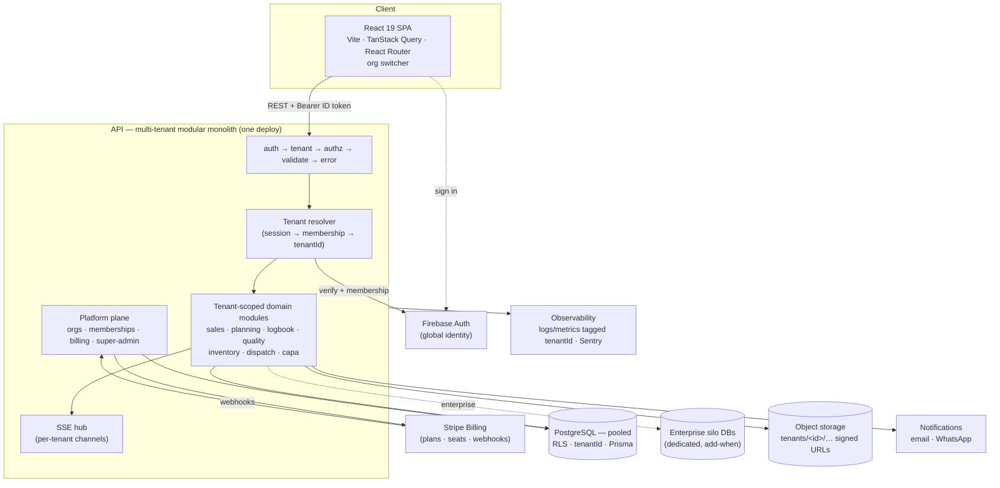
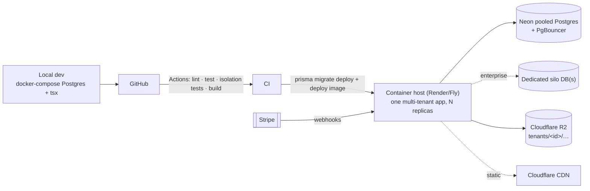

# Mass Polimer ERP — System Architecture (the blueprint)

The definitive end-state design for a **multi-tenant SaaS** ERP: one product sold to many manufacturers ("tenants"), each with isolated data, users, config, and billing. `backend-architecture.md` details the backend and its decision log; `production-readiness.md` is the audit this addresses. This document is the top-level picture and the calls made for every layer.

**One-line verdict:** a **multi-tenant, type-safe modular monolith** — React SPA + one Express/Postgres API — where every tenant shares the app and a **pooled** database, isolated by a `tenantId` on every row and enforced by **Postgres Row-Level Security + an app-layer guard**. Firebase for identity, Stripe for billing, object storage for files. A **silo** (dedicated database) tier exists for enterprise customers who need hard isolation or data residency. Not microservices, not Kubernetes. Reached from today's click-dummy by a strangler migration.

## Guiding principles

1. **Tenant isolation is a security invariant, not a feature.** No request may ever read or write another tenant's data. It is enforced twice — in the database (RLS) and in the app (mandatory tenant scoping) — so a single forgotten `where` clause can't leak data.
2. **Tenant context is server-derived, never client-supplied.** The active tenant comes from the authenticated user's membership, resolved server-side. A client-sent `tenantId` is ignored.
3. **Server is the authority.** All data and every authorization decision live server-side; the client is a view.
4. **Type-safe end to end.** TypeScript everywhere, Zod at the HTTP boundary, Prisma at the DB boundary.
5. **Modular monolith, not microservices.** One deploy, one database (pooled), bounded domain modules.
6. **Right-sized ops.** Managed services (Postgres, storage, auth, billing). Add infrastructure (Redis, queues, silos, CDN) only when a real constraint demands it — each is called out as "add when."
7. **Strangler migration.** The click-dummy keeps running; domains move to the real backend one at a time behind a stable API.

## Tenancy model (the foundational decision)

| Concern | Decision |
|---|---|
| **Isolation strategy** | **Pooled** — shared database, shared schema, a `tenantId` column on every tenant-owned row. Cheapest to operate, one migration for all, easiest analytics. |
| **Enforcement** | **Defense in depth:** (1) Postgres **Row-Level Security** policies keyed on a per-transaction session variable = the hard guarantee; (2) an **app-layer Prisma guard** that sets that variable + injects `organizationId` on writes from request context = ergonomics + a second net. The app connects as a **non-superuser** DB role (`app_user`) so RLS actually binds — superusers/BYPASSRLS roles ignore it. Either layer alone would be a single point of failure. |
| **Enterprise escape hatch** | **Silo** — a dedicated database (optionally a dedicated region) for customers who require hard isolation or data residency. Same codebase, connection resolved per tenant. **Add when** an enterprise deal requires it. |
| **Tenant of record** | An **Organization** row. Provisioned on signup; carries plan, settings, branding, status. |
| **Identity ↔ tenant** | A global **User** (Firebase identity) has one or more **Memberships** `(userId, tenantId, role, status)`. Users can belong to several orgs (org switcher); the session pins one *active* tenant. |
| **Vendor plane** | A separate **platform super-admin** context (you) for provisioning, billing, support, and cross-tenant ops — its own auth boundary and audit trail, **not** a tenant role. |

### How a request gets its tenant

```mermaid
sequenceDiagram
  participant SPA
  participant API
  participant FB as Firebase Auth
  participant PG as Postgres (RLS)
  SPA->>API: request + Bearer ID token (+ active org id)
  API->>FB: verifyIdToken
  FB-->>API: uid
  API->>PG: load Membership(uid, activeOrg) → tenantId + role
  Note over API: reject if no active membership
  API->>API: put {tenantId, role} in AsyncLocalStorage
  API->>PG: BEGIN; set_config('app.current_tenant', tenantId); ...queries...; COMMIT
  Note over PG: RLS policy: row.tenantId = current_setting('app.current_tenant')
  PG-->>API: only this tenant's rows
  API-->>SPA: data
```

The Prisma client used per request is wrapped so **every** query runs inside a transaction that first sets `app.current_tenant`; RLS then filters at the database. The same extension refuses writes whose `tenantId` doesn't match context. Client-supplied tenant hints are never trusted.

## Container view



## Layer-by-layer decisions

| Layer | Decision | Why |
|---|---|---|
| **Tenancy** | Pooled shared-schema + `tenantId` + **RLS** + app guard; silo tier for enterprise | Cheap to run, hard isolation, room for enterprise |
| **Tenant context** | AsyncLocalStorage per request; Prisma tx sets `app.current_tenant` | One place derives tenant; RLS enforces it |
| **Identity** | **Firebase Auth** (global), verified server-side | One login across orgs; no hand-rolled crypto |
| **Membership & roles** | `Organization` + `Membership(user, tenant, role, status)`; per-tenant RBAC | A user can serve multiple plants; roles scoped per org |
| **Platform admin** | Separate super-admin plane + audit | Vendor ops must not be a tenant role |
| **Billing** | **Stripe Billing** — plans/tiers, per-seat, webhooks → subscription status | Selling to customers = subscriptions + entitlements |
| **Entitlements** | Plan → enabled modules + limits (seats, machines), checked in authz | Monetize tiers; enforce limits server-side |
| **Provisioning** | Signup → create Org → seed baseline (templates, roles, units) → owner membership → invites | Self-serve onboarding |
| **Per-tenant config** | `TenantSettings` (branding, units, feature flags) + per-tenant templates/catalogs | Each customer differs; documents carry their brand |
| **Frontend** | React 19 + Vite + **React Router** (route-level `lazy()`), **TanStack Query** (server state), **Zustand** (UI state), Tailwind v4 tokens | URL-addressable, code-split, cached; org switcher in shell |
| **API** | **REST + Zod**, OpenAPI docs; **modular monolith** `modules/<domain>/{router,service,schema}` | Decoupled, documented, domain-bounded |
| **Business logic** | Service layer owns rules + **transactions**; Prisma repository | Atomic value-chain transitions, tenant-safe |
| **Database** | **PostgreSQL** + **Prisma**; `tenantId` + composite uniques; per-tenant sequences | Relational integrity *within* a tenant; numbers unique per tenant |
| **Concurrency** | **Optimistic locking** (`version` → 409) | Record-level clobber protection |
| **Audit / trace** | Append-only **`AuditEvent`** (tenant-scoped) | Real Batch Passport + ISO compliance, per tenant |
| **Real-time** | **SSE**, per-tenant channels → TanStack Query invalidation | Live boards without cross-tenant leakage |
| **Files** | S3-compatible (**Cloudflare R2**), keys `tenants/<id>/…`, signed URLs | Isolated media; swappable for S3/GCS |
| **PDF** | Server-side HTML→PDF (headless Chromium), tenant-branded | Gate passes, invoices, logbook sheets |
| **Notifications** | Provider interface → **Resend** (email) + **Twilio** (WhatsApp) | Per-tenant sender identity |
| **Jobs** | **node-cron** now → **BullMQ + Redis** at scale; jobs iterate tenants | Reminders, capacity recompute |
| **Config** | Zod-validated `env` module | Fail fast; no `process.env` sprawl |
| **Observability** | **pino** logs + **Sentry**, every event tagged `tenantId` | Per-tenant debugging + usage |
| **Security** | Helmet, origin-locked CORS, `express-rate-limit` (per tenant + per IP) | Standard hardening + noisy-neighbor control |

## Backend module structure

```
server/src/
  index.ts · app.ts · db.ts · config.ts
  middleware/   auth · tenant · authz(+entitlements) · validate · error · log
  lib/          tenantContext(AsyncLocalStorage) · prismaTenantGuard · permissions · ids · audit · events(SSE)
  platform/     organizations · memberships · invitations · billing(stripe) · superAdmin   (global scope)
  modules/      sales · planning · logbook · quality · inventory · dispatch · capa   (tenant scope)
  modules/trace Batch Passport projection over AuditEvent + entities (tenant scope)
```

Request flow: `requestLog → authenticate → resolveTenant → requirePermission(feature)+checkEntitlement → validateBody → handler → service (tenant-scoped Prisma tx, emits AuditEvent + per-tenant SSE) → response`.

## Data model & tenancy

- **Global (no tenantId):** `User` (identity), `Organization`, `Membership`, `Invitation`, `Plan`, platform audit.
- **Tenant-owned (tenantId on every row):** customers, inquiries, orders, plans, logbook templates, logbooks, inspections, inventory, dispatches, complaints, CAPA, recipes, maintenance, machines, suppliers, permissions/grants/delegations, settings, and `AuditEvent`.
- **Uniqueness is per tenant:** `@@unique([tenantId, soNumber])`, `[tenantId, inquiryNumber]`, `[tenantId, email]` for members, etc. Document numbering sequences are **per tenant** (Acme's SO-1 and Beta's SO-1 coexist).
- **FKs stay within a tenant;** RLS ensures a query can only ever see one tenant's rows, so joins are automatically tenant-safe.
- **Provisioning seed** (per new org): baseline logbook templates, default roles/permissions, rejection reasons, units — copied from a global **starter library**, then owned and editable by the tenant. The current `mockData` becomes a **demo tenant**, not a global seed.

## Onboarding & tenant lifecycle

```
sign up → create Organization (+Stripe customer) → seed baseline config
        → owner Membership → invite teammates (email) → accept → Membership
suspend (non-payment / offboarding) → read-only or blocked
export (self-serve tenant data export) → offboard → hard-delete after retention window
```

## Billing & entitlements

- **Stripe Billing**: each Organization is a Stripe customer with a subscription to a **Plan** (tier + seats). Webhooks keep `Organization.subscriptionStatus` current.
- **Entitlements**: a plan maps to **enabled modules** and **limits** (seats, machines, storage). The authz layer checks entitlements alongside permissions — over-limit or past-due returns a clear `402/403`, not a broken screen.

## Deployment topology



- **One multi-tenant app**, horizontally scalable (stateless replicas). Tenant comes from the session, not the host — but **custom domains / vanity subdomains** (acme.masspolimer.app) map to a tenant for branding and are an **enterprise add-on**.
- **Pooled Postgres** (Neon) behind **PgBouncer** for connection pooling; **silo** DBs for enterprise, resolved per tenant.
- **Environments:** `dev` (local), `staging`, `prod`; identical images; migrations run on deploy across the pool (and each silo).

## CI/CD & testing

- **CI (GitHub Actions):** on PR → client + server `tsc` → Vitest (unit) → **Supertest integration incl. mandatory cross-tenant isolation tests** (tenant A must never see tenant B) → build; block on red. On merge → image → `prisma migrate deploy` → deploy → `/api/health` smoke.
- **Isolation tests are first-class:** seed two tenants, assert every endpoint and every list is scoped; assert a forged `tenantId` is ignored; assert RLS blocks a raw cross-tenant query. This is the highest-value test suite in a SaaS.
- **E2E (Playwright):** signup → provision → invite → the order→plan→logbook→QA→dispatch flow, run against two tenants in parallel.

## Migration roadmap (strangler)

| Phase | What | Status |
|---|---|---|
| 0 | Backend foundation — schema, migration, seed, middleware chain, dev-auth seam | ✅ done |
| **0.5** | **Tenancy retrofit** — `Organization`/`User`/`Membership`, `organizationId` + composite uniques on every table, RLS (FORCE) + non-superuser `app_user`, the tenant-context Prisma guard, per-tenant provisioning seed. Cross-tenant isolation verified (raw query fail-closed; org B can't read org A). | ✅ **done** |
| 1 | Vertical slice — users/members + customers→inquiry→quotation→order (server + frontend), fully tenant-scoped | ⬜ |
| 2 | Firebase-verify auth + membership resolution (swap the dev-stub middleware body) | ⬜ |
| 3 | Onboarding + billing (Stripe) + entitlements + org switcher | ⬜ |
| 4 | Remaining domains end-to-end, all tenant-scoped | ⬜ |
| 5 | Value-chain transactions + `AuditEvent` + real Batch Passport | ⬜ |
| 6 | Real-time (SSE), files, PDF, notifications | ⬜ |
| 7 | Observability, security hardening, isolation-test gate, CI/CD, deploy; enterprise silo option | ⬜ |

> **Implementation delta from the foundation already shipped:** the current schema has no `tenantId`. Phase 0.5 adds the `Organization`/`Membership` tables, a `tenantId` (+ index) and per-tenant composite uniques to every tenant-owned model, RLS policies, and the per-request tenant-guard — as one migration. Cheap now (no production data), expensive later.

## Explicitly NOT doing (right-sizing)

- **Microservices / Kubernetes** — a multi-tenant modular monolith scales horizontally as stateless replicas; split a module out only if it ever needs independent scaling.
- **Database-per-tenant *by default*** — pooled + RLS is cheaper and simpler; silo is the enterprise exception, not the norm.
- **GraphQL** — REST + OpenAPI fits an internal ERP with clear resources.
- **Event sourcing / CQRS everywhere** — the append-only `AuditEvent` log gives traceability without rebuilding the write model.
- **Per-tenant custom code / forks** — tenants get configuration and feature flags, never bespoke branches; that's how a SaaS stays maintainable.
- **Redis / queues on day one** — added when caching, cross-instance SSE, or durable jobs actually demand it.

*Deferred by right-sizing, not oversight — each has a clear "add when" trigger.*
