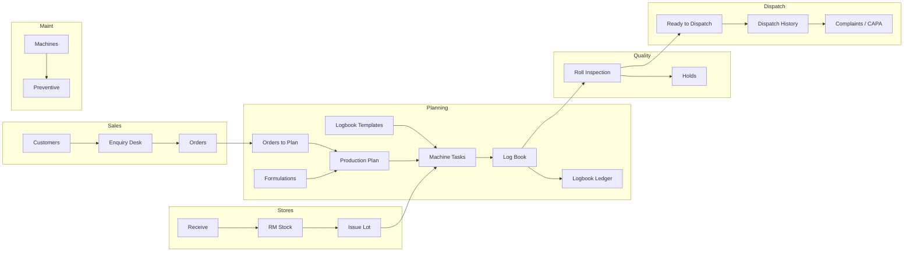

# MesaOps — Client Requirements Questionnaire & Data Format

**Purpose:** Before quotation finalization and go-live, collect how the client runs their plant today and what master/transaction data they must supply. Answers drive scope, configuration, and product enhancements.

**Scope:** MesaOps only (plant operations). MesaERP / finance / legal books are out of scope unless noted as an optional handoff.

**Live MesaLeads form:** The customer-facing questionnaire is published under family key
`mesaops-plant-digitisation-requirements` (see `src/mesaleads/mesaopsPlantForm.ts` and
`npm run provision:mesaworks`). Section K CSV / Excel templates below remain the
post-questionnaire master-data pack for implementation.

**How to use**
1. Client completes the MesaLeads questionnaire (or Sections A–J below as a paper/workshop fallback).
2. Client fills Section K (data templates) for every in-scope module.
3. MesaWorks maps gaps → configuration vs custom enhancement vs out-of-scope.
4. Quotation lists: included modules, roles, integrations, data migration, and change requests.

---

## Canonical MesaOps business flow

```text
Customers → Enquiry Desk (inquiry → quote) → Orders
    → Orders to Plan → Production Plan (machine × shift)
    → Formulations (BOM) + Logbook Templates
    → Machine Tasks → Production Log Book → Logbook Ledger
    → Roll Inspection / Quality Holds
    → RM Receive → Issue Lot → RM Stock
    → Ready to Dispatch → Dispatch History
    → Complaints & CAPA (post-dispatch loop)
    → Machines + Preventive Maintenance
    → People & Roles / Access
```

Optional demand sources (when MesaERP is absent or linked later): local customer, internal, forecast, replenishment, trial, rework, import.

---

## A. Plant & organization profile

| # | Question | Answer (client) |
| --- | --- | --- |
| A1 | Legal / trading name | |
| A2 | Number of plants / sites to run on MesaOps | |
| A3 | Plant codes and names (e.g. `PRIMARY`, `PUNE-1`) | |
| A4 | Industry / process (PVC pipe, coil, film, rubber, other) | |
| A5 | Primary UOMs for FG and RM (kg, m, nos, roll, …) | |
| A6 | Shift model (Day/Night only, or more?) | |
| A7 | Working calendar (days/week, holidays, overtime rules) | |
| A8 | Languages needed on shop floor | |
| A9 | Devices: desktop office, tablets, phones, shared kiosk? | |
| A10 | Must MesaOps run offline / poor network on shop floor? | Yes / No — details: |
| A11 | Existing systems (ERP, Excel, Tally, SAP, custom MES) | |
| A12 | Will MesaERP (or another ERP) feed sales orders into MesaOps? | Yes / No / Later |

---

## B. Feature selection (include / configure / enhance / out)

For each feature: mark **I** = Include as-is · **C** = Configure · **E** = Enhance (gap) · **O** = Out of scope.

### B1. Overview

| Feature | Screen / capability | I/C/E/O | Notes / gaps |
| --- | --- | --- | --- |
| Home dashboard | Role KPI home | | |
| Management overview | Stock / queue drill-downs | | |
| Batch / order trace search | Trace across value chain | | |

### B2. Sales & orders

| Feature | Screen / capability | I/C/E/O | Notes / gaps |
| --- | --- | --- | --- |
| Customers | Master: GST, contacts, billing/delivery, payment terms | | |
| Enquiry Desk | Inquiry → quotation → negotiate | | |
| Orders | Confirm to production, priority, special instructions | | |
| Complaints & CAPA | Post-dispatch complaint → root cause / CA / PA | | |
| Operational orders (non-sales) | Internal / forecast / trial / rework / import | | |

**Sales questions**

| # | Question | Answer |
| --- | --- | --- |
| B2.1 | How does an enquiry become a confirmed order today? | |
| B2.2 | Who approves price / discount / priority? | |
| B2.3 | Product identification: name only, SKU, drawing no., customer part no.? | |
| B2.4 | Do you need multi-line orders, variants, or one product per order? | |
| B2.5 | Must quotations / PDFs match a client letterhead template? | |

**Complaints & CAPA questions** (when module selected)

| # | Question | Answer |
| --- | --- | --- |
| B2.7 | How are customer complaints recorded today (register, Excel, email)? | |
| B2.8 | Complaint types (quality, quantity, packing, delivery, …) | |
| B2.9 | Severity levels and response / closure timelines | |
| B2.10 | Root-cause investigation method (5-Why, batch trace, …) | |
| B2.11 | CA / PA fields and approval chain | |
| B2.12 | Attach sample complaint / CAPA format | |

### B3. Planning & production

| Feature | Screen / capability | I/C/E/O | Notes / gaps |
| --- | --- | --- | --- |
| Orders to Plan | Queue of confirmed / operational demand | | |
| Production Plan | Machine, shift D/N, operator, dates, drawing/formula | | |
| Task sequence | Ordered task codes on a plan | | |
| Formulations (BOM) | Formula code + component % / lots | | |
| Logbook templates | Pipe / coil layouts, zones, specs, rejection reasons | | |
| Machine Tasks | Operator work list; open log book from task | | |
| Production Log Book | Hourly readings, zones, scrap, rolls, sign-off | | |
| Logbook Ledger | Historical / audit view of log books | | |
| Machine QR | Scan machine → tasks / log book | | |

**Planning & production questions**

| # | Question | Answer |
| --- | --- | --- |
| B3.0 | **Project scope (free text)** — client describes requirement in own words | |
| B3.1 | Planning unit: machine × shift, line, work centre, or cell? | |
| B3.2 | Required fields on every plan (drawing, formula, supervisor, …) | |
| B3.3 | Can one order split across machines / shifts / days? | |
| B3.4 | How are operators assigned (named person, crew, skill matrix)? | |
| B3.5 | Product families and which logbook layout each uses (pipe / coil / other) | |
| B3.6 | Describe each logbook format (columns, shift/hourly rows, doc no. / rev) | |
| B3.7 | Temperature zones: names, targets, limits; die / barrel zone counts | |
| B3.8 | Hourly vs continuous readings; mandatory inspection time slots | |
| B3.9 | How finished output is recorded (rolls, meters, weight, pieces) | |
| B3.10 | Scrap / waste categories and rejection reasons | |
| B3.11 | Sign-off: operator only, or operator + supervisor dual sign? | |
| B3.12 | Attach sample paper logbook or Excel sheet | |

### B4. Quality

| Feature | Screen / capability | I/C/E/O | Notes / gaps |
| --- | --- | --- | --- |
| Roll Inspection Queue | Pass / hold / fail on lots | | |
| Quality Holds | Hold board and release / disposition | | |
| Inspection checks | Finish, colour, tearing, dimensions, weight | | |
| QA override | Override a prior verdict (controlled) | | |

**Quality questions**

| # | Question | Answer |
| --- | --- | --- |
| B4.1 | What is inspected (roll, lot, batch, piece, meter)? | |
| B4.2 | Mandatory checks beyond finish / colour / tearing / dimensions? | |
| B4.3 | Hold disposition: rework, scrap, downgrade, customer waiver? | |
| B4.4 | Who may override a fail / hold? | |
| B4.5 | Incoming RM inspection required before receive/issue? | |

### B5. Stores (physical inventory)

| Feature | Screen / capability | I/C/E/O | Notes / gaps |
| --- | --- | --- | --- |
| Receive Material | Inward RM with lot / supplier ref | | |
| Issue Lot | Issue to machine | | |
| RM Stock Board | On-hand by item | | |

**Stores questions**

| # | Question | Answer |
| --- | --- | --- |
| B5.1 | Warehouse / bin structure (single store, multiple bins, locations)? | |
| B5.2 | Lot / batch mandatory on every receive? | |
| B5.3 | Issue against plan, machine only, or BOM reservation? | |
| B5.4 | FG put-away after QA pass — required in MesaOps? | |
| B5.5 | Valued inventory / costing — MesaERP or out of scope here? | |

### B6. Dispatch

| Feature | Screen / capability | I/C/E/O | Notes / gaps |
| --- | --- | --- | --- |
| Ready to Dispatch | Mark movement against order | | |
| Dispatch History | Past dispatches | | |
| Movement types | supply / transfer / job_work / return / other | | |
| Vehicle / transporter / driver / ETA | | | |
| Statutory evidence (optional) | Invoice / e-way bill verified evidence | | |

**Dispatch & packing questions**

| # | Question | Answer |
| --- | --- | --- |
| B6.1 | How finished goods are packed (rolls, bundles, cartons, labels) | |
| B6.2 | Packing label fields (product, lot, weight, PO, …) | |
| B6.3 | Weight check at packing or dispatch? | |
| B6.4 | Steps from QA pass to gate out (who signs at each step) | |
| B6.5 | Gate pass / delivery challan / packing list fields | |
| B6.6 | Partial dispatch allowed? How is balance tracked? | |
| B6.7 | Documents that must travel with shipment | |
| B6.8 | Job-work / transfer / return movements needed? | |
| B6.9 | Invoice / e-way bill: MesaERP, external, or manual attach? | |

### B7. Maintenance

| Feature | Screen / capability | I/C/E/O | Notes / gaps |
| --- | --- | --- | --- |
| Machines | Code, line, family, status, QR, logbook format | | |
| Preventive Schedule | Preventive / Calibration / Overhaul / Breakdown | | |
| Breakdown close | Controlled close of breakdowns | | |

**Maintenance questions**

| # | Question | Answer |
| --- | --- | --- |
| B7.1 | Machine families and coding scheme | |
| B7.2 | PM frequencies in use (Weekly / Monthly / …) | |
| B7.3 | Calibration certificates / external vendors tracked? | |
| B7.4 | Downtime reason codes required? | |

### B8. Admin & access

| Feature | Screen / capability | I/C/E/O | Notes / gaps |
| --- | --- | --- | --- |
| People & Roles | Employee directory | | |
| Roles & Access | Screen / action ACL, per-employee grants | | |

**Default roles (confirm or customize)**

| Role | Keep? | Rename / merge / split |
| --- | --- | --- |
| Managing Director | | |
| Sales Executive | | |
| Production Planner | | |
| Operator | | |
| Quality Inspector | | |
| Store Manager | | |
| Dispatch Executive | | |
| Maintenance Head | | |
| Administrator | | |

| # | Question | Answer |
| --- | --- | --- |
| B8.1 | SSO / Google / email-password / shared shop-floor login? | |
| B8.2 | Plant-scoped access required (user sees only one plant)? | |
| B8.3 | Audit / retention requirements (years) | |

---

## C. Gap & enhancement register

List every **E** from Section B. One row per change request.

| ID | Module | Current MesaOps behaviour | Client required behaviour | Priority (Must/Should/Could) | Attachments |
| --- | --- | --- | --- | --- | --- |
| E-001 | | | | | |
| E-002 | | | | | |

---

## D. Integrations (optional)

| System | Direction | Objects | Frequency | Owner contact |
| --- | --- | --- | --- | --- |
| MesaERP / other ERP | In / Out / Both | Orders, customers, items, statutory | | |
| Weighing scales / PLC | | | | |
| Label / barcode printers | | | | |
| WhatsApp / email alerts | | | | |

---

## E. Success criteria & go-live

| # | Question | Answer |
| --- | --- | --- |
| E1 | Go-live plant and target date | |
| E2 | Parallel run with paper / old system? Duration? | |
| E3 | Definition of done (e.g. full week of logbooks + 1 dispatch cycle) | |
| E4 | Training audience and language | |
| E5 | Named client project owner + MesaWorks counterpart | |

---

## K. Requirement data format (master data to supply)

Use UTF-8 CSV (preferred) or Excel. One header row. Dates: `YYYY-MM-DD`. Empty optional fields allowed. Do not put secrets in shared sheets.

### K1. Plants

| Field | Required | Type | Example | Notes |
| --- | --- | --- | --- | --- |
| plant_code | Yes | string ≤40 | `PRIMARY` | `[A-Za-z0-9._-]+` |
| plant_name | Yes | string | `Pune Plant` | |
| timezone | Yes | string | `Asia/Kolkata` | |
| address | No | string | | |

### K2. Employees

| Field | Required | Type | Example | Notes |
| --- | --- | --- | --- | --- |
| employee_code | No | string | `EMP-012` | |
| name | Yes | string | `Nandlal` | |
| email | Yes | email | `op@client.com` | Login identity |
| role | Yes | enum | `Operator` | From role list or custom |
| department | No | string | `Extrusion` | |
| shift | No | `D` / `N` | `D` | |
| plant_code | No | string | `PRIMARY` | Scope if multi-plant |
| status | No | enum | `active` | `active` / `on_leave` / `inactive` |

### K3. Customers

| Field | Required | Type | Example |
| --- | --- | --- | --- |
| customer_code | No | string | `CUST-100` |
| name | Yes | string | `Acme Pipes Pvt Ltd` |
| gst_number | No | string | |
| contact_person | No | string | |
| phone | No | string | |
| email | No | email | |
| billing_address | No | string | |
| delivery_address | No | string | |
| payment_terms | No | string | `Net 30` |
| status | No | enum | `active` / `inactive` |

### K4. Products / SKUs

| Field | Required | Type | Example | Notes |
| --- | --- | --- | --- | --- |
| product_code | No | string | `PVC-20MM` | |
| product_name | Yes | string | `20mm Soft Coil` | |
| uom | Yes | string | `roll` | |
| family | No | string | `PVC` | Links to machine family / template |
| drawing_no | No | string | `DRW-20` | Often required on plan |
| default_formula_no | No | string | `F-20-A` | |
| default_mold_no | No | string | `M-20` | |
| logbook_layout | No | enum | `coil` | `pipe` / `coil` / other agreed |

### K5. Machines

| Field | Required | Type | Example | Notes |
| --- | --- | --- | --- | --- |
| plant_code | Yes | string | `PRIMARY` | |
| machine_code | Yes | string ≤16 | `EXT-01` | Unique per plant |
| line | Yes | string | `Extruder Line 1` | Description |
| family | Yes | string | `PVC` | |
| logbook_format | No | string | `coil` | Template key |
| status | No | enum | `running` | `running` / `attention` / `stopped` |

### K6. Formulations (BOM)

| Field | Required | Type | Example |
| --- | --- | --- | --- |
| formula_code | Yes | string | `F-20-A` |
| product_name | No | string | `20mm Soft Coil` |
| component_name | Yes | string | `PVC Resin` |
| component_pct | Yes | number 0–100 | `65.5` |
| preferred_lot_hint | No | string | |

One row per component. Multiple rows share the same `formula_code`.

### K7. Raw materials / items

| Field | Required | Type | Example |
| --- | --- | --- | --- |
| item_code | No | string | `RM-PVC` |
| item_name | Yes | string | `PVC Resin` |
| unit | Yes | string | `kg` |
| plant_code | No | string | `PRIMARY` |

### K8. Opening RM stock / lots (optional migration)

| Field | Required | Type | Example |
| --- | --- | --- | --- |
| plant_code | Yes | string | `PRIMARY` |
| item_name | Yes | string | `PVC Resin` |
| item_code | No | string | |
| quantity | Yes | number > 0 | `1200` |
| unit | Yes | string | `kg` |
| lot_number | No | string | `LOT-2401` |
| reference | No | string | `Opening / PO-991` |

### K9. Preventive maintenance schedule

| Field | Required | Type | Example |
| --- | --- | --- | --- |
| machine_code | Yes | string | `EXT-01` |
| task_name | Yes | string | `Grease gearbox` |
| type | Yes | enum | `Preventive` | `Preventive` / `Calibration` / `Overhaul` / `Breakdown` |
| frequency | Yes | enum | `Monthly` | `Weekly` / `Monthly` / `Quarterly` / `Semiannually` / `Once (Breakdown)` |
| due_date | Yes | date | `2026-09-01` |
| cost | No | number | `0` |

### K10. Logbook template profile (per product family)

Provide either a filled sample PDF/scan of the current paper logbook **or** this sheet:

| Field | Required | Type | Example |
| --- | --- | --- | --- |
| product_name | Yes | string | `20mm Soft Coil` |
| layout | Yes | enum | `coil` |
| doc_no | No | string | `QR/MFG/013` |
| rev_no / rev_date | No | string | |
| brand_name / location / title | No | string | |
| hardness_type | No | `A` / `D` | |
| production_unit | No | `nos` / `roll` | |
| shifts | No | list | `D,N` |
| supervisors | No | list | names |
| die_zones | No | list | `Z1,Z2,Z3` |
| barrel_zones | No | list | `B1,B2,B3,B4` |
| zone_specs | No | JSON | `{"Z1":{"target":180,"min":175,"max":185}}` |
| rejection_reasons | No | list | `Ovality,Burn,…` |
| packing_note | No | string | |
| dimension_specs | No | JSON / attach drawing | |

### K11. Sample transactional seed (optional, for UAT)

Minimum happy-path set for dry-run:

| Artifact | Minimum count | Notes |
| --- | --- | --- |
| Customers | 3 | Including one with complaint history if testing CAPA |
| Enquiries → Orders | 5 | Mix of priorities |
| Plans | 5 | Across ≥2 machines and both shifts |
| Logbook entries | 3 signed | With rolls / scrap |
| QA pass + 1 hold | 1 each | |
| RM receive + issue | 2 | |
| Dispatch | 2 | One partial if used |
| PM tasks | 3 | |

---

## L. JSON envelope (optional machine-readable pack)

Clients or integrators may also deliver a single JSON file:

```json
{
  "schema": "mesaorigins.mesaops.client-requirements.v1",
  "client": { "name": "", "plants": [] },
  "featureSelection": {
    "sales_customers": "include",
    "enquiry_desk": "configure",
    "logbook_templates": "enhance"
  },
  "enhancements": [
    { "id": "E-001", "module": "quality", "priority": "must", "summary": "" }
  ],
  "masters": {
    "employees": [],
    "customers": [],
    "products": [],
    "machines": [],
    "formulations": [],
    "rmItems": [],
    "openingStock": [],
    "preventiveSchedule": [],
    "logbookTemplates": []
  },
  "integrations": [],
  "goLive": { "plantCode": "", "targetDate": "", "successCriteria": "" }
}
```

Feature keys should match MesaOps screens:  
`dashboard`, `sales_customers`, `enquiry_desk`, `orders`, `sales_complaints`, `orders_to_plan`, `plan_board`, `formulations`, `logbook_templates`, `machine_tasks`, `logbook_ledger`, `roll_queue`, `holds`, `receive`, `issue_lot`, `rm_stock`, `ready`, `dispatch_history`, `machines`, `preventive`, `users`, `acl`.

Selection values: `include` | `configure` | `enhance` | `out`.

---

## M. Quotation checklist (internal)

Use completed questionnaire to price:

- [ ] Modules in scope (I + C + E)
- [ ] Plants × users × roles
- [ ] Logbook template count (families / layouts)
- [ ] Master data migration (rows in K2–K9)
- [ ] Enhancement count by Must/Should/Could
- [ ] Integrations and statutory evidence
- [ ] Training days and UAT support window
- [ ] Explicit out-of-scope list (O + MesaERP-only items)

---

## Appendix — MesaOps value-chain map (for workshops)


